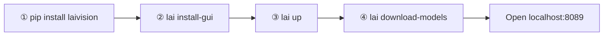

# LAI

[](https://github.com/kilimi/lai/actions/workflows/ci.yml)
[](https://pypi.org/project/laivision/)
[](https://hub.docker.com/r/luluray/lai-backend)

**[laivision.dk](https://laivision.dk)** — project site, workflow overview, and tutorials.

Self-hosted **computer vision studio**: datasets, SAM-assisted annotation, training (YOLO / MMYOLO / RT-DETR), evaluation, and export.

Install a small CLI from **PyPI**, pull pre-built images from **Docker Hub**, and run everything with **`lai`**. No git clone required.

**Tested on:** Linux (Ubuntu) and Windows 10/11 (Docker Desktop + WSL2).

---

## Requirements

| Requirement | Notes |
|-------------|--------|
| **OS** | **Linux** or **Windows 10/11** (see platform notes below) |
| **Docker Engine** + **Compose v2.24+** | `docker compose version` must work |
| **Python 3.10–3.12** | For the `lai` CLI only — not for running the app itself |
| **RAM** | 8 GB minimum · 16 GB+ recommended (32 GB with GPU tier) |
| **Disk** | ~5 GB (CPU stack) · ~20–30 GB (GPU images + models) |
| **Browser** | For `lai install-gui` and the studio UI |
| **NVIDIA GPU** *(optional)* | Training, auto-annotate, SAM — GPU tier + [Container Toolkit](https://docs.nvidia.com/datacenter/cloud-native/container-toolkit/install-guide.html) (Linux) or WSL2 GPU passthrough (Windows) |

You do **not** need Node.js, a git checkout, or local image builds for the quick start.

### Linux

- [Docker Engine](https://docs.docker.com/engine/install/) + Compose plugin
- Install CLI with [pipx](https://pipx.pypa.io/) or a venv (recommended on Debian/Ubuntu — do not use system `pip`; [PEP 668](https://peps.python.org/pep-0668/))

### Windows

- [Docker Desktop](https://docs.docker.com/desktop/setup/install/windows-install/) with **WSL2** backend
- `lai install-gui` works in any browser; terminal `lai install` needs **Git Bash** or **WSL**
- GPU tier: enable WSL2 integration in Docker Desktop and install NVIDIA drivers for WSL

---

## Quick start



### ① Install the CLI

```bash
pip install laivision
# recommended:  pipx install laivision
```

Installs the **`lai`** command and embeds Docker Compose files inside the package. Your settings live in **`~/.config/lai/.env`** (not in site-packages), so upgrades do not overwrite them.

---

### ② First-time setup

```bash
lai install-gui
```

Opens a **browser wizard** on `http://127.0.0.1:…` where you choose:

| Setting | Default | Purpose |
|---------|---------|---------|
| Data directory | `~/lai-data` | Databases, datasets, projects, model cache |
| Web port | `8089` | UI in your browser |
| GPU tier | off | Enables `worker-gpu` + `sam_service` (NVIDIA required) |
| SAM 3 folder | `~/lai-data/sam3-models` | Optional checkpoint path (SAM 2 works without it) |

Terminal alternative: `lai install` or `lai install --yes` for non-interactive defaults.

---

### ③ Start the stack

```bash
lai up
```

- Pulls images from Docker Hub (`luluray/lai-*`) if they are not local yet  
- Starts database, API, workers, and web UI  
- First run may take several minutes while images download  

Open **`http://localhost:8089`** (or the port you chose).

```bash
lai down          # stop containers
lai doctor        # version, Docker checks, bundle path
lai upgrade       # after pip install -U laivision
```

---

### ④ Download foundation models *(optional, after stack is up)*

```bash
lai download-models
```

Pre-downloads training and inference weights into your data directory (`$LAI_DATA_DIR/models`):

```bash
lai download-models --yolo yolov8n.pt      # single Ultralytics weight
lai download-models --mmyolo minimal         # MMYOLO pretrained checkpoints
lai download-models --depth minimal          # depth estimation ONNX
```

Without this step, many features still work; downloads happen on first use or you can run the commands above anytime.

---

## Optional extras

**SAM 3** — SAM 2 is included. For SAM 3, place a checkpoint (e.g. from [Hugging Face](https://huggingface.co/facebook/sam3)) at the path from the wizard, then:

```bash
lai restart sam_service
```

**GPU check** (if GPU tier is enabled):

```bash
docker compose exec worker-gpu nvidia-smi
```

---

## Where things live

| Path | Contents |
|------|----------|
| `~/.config/lai/.env` | Ports, data dir, Docker image tags |
| `~/lai-data/` *(default)* | Postgres/Redis/Mongo data, projects, models |
| PyPI package `lai/bundle/` | Read-only compose files (do not edit) |

---

## Advanced setup

**Git checkout, building images locally, running tests, maintainer releases** → see **[README_advanced.md](README_advanced.md)**.

---

## License

[AGPL-3.0](LICENSE) — bundled ML runtimes (YOLO, MMYOLO, SAM) have additional upstream licenses. Details in [README_advanced.md#license](README_advanced.md#license).
